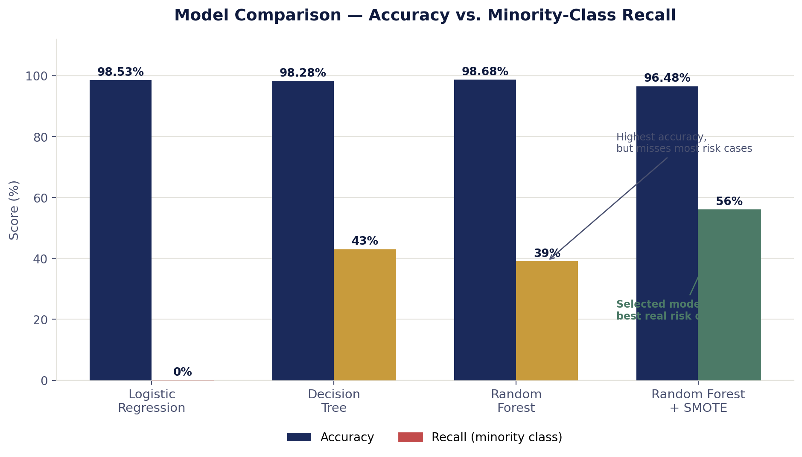

<div align="center">

# 💳 Credit Card Approval Prediction System

### An ML-powered web app that predicts credit approval — from raw data to live deployment

[](https://www.python.org/)
[](https://flask.palletsprojects.com/)
[](https://scikit-learn.org/)
[](https://www.sqlite.org/)
[](https://grace18.pythonanywhere.com)

**[🔗 Live Demo](https://grace18.pythonanywhere.com)** · **[📓 Notebook](./credit_card_prediction.ipynb)** · **[📄 Full Documentation](./project_documentation.md)**

</div>

<br>

> 🧠 **The core story of this project:** the model with the *highest accuracy* was deliberately **not** the one shipped to production. On a dataset this imbalanced, accuracy alone lies — this README (and the notebook) shows why, and what was chosen instead.

<br>

---

## 📌 At a Glance

<table>
<tr>
<td width="25%" align="center"><b>777,715</b><br><sub>merged records</sub></td>
<td width="25%" align="center"><b>18</b><br><sub>input features</sub></td>
<td width="25%" align="center"><b>4</b><br><sub>models compared</sub></td>
<td width="25%" align="center"><b>96.48%</b><br><sub>final model accuracy</sub></td>
</tr>
</table>

---

## 🎯 The Modeling Story

Four classifiers were trained. The winner isn't the one you'd guess by accuracy alone:

| Model | Accuracy | Recall (minority class) | |
|---|:---:|:---:|---|
| Logistic Regression | 98.53% | **0%** | 🚩 predicted majority class *every single time* |
| Decision Tree | 98.28% | 43% | a single tree — prone to overfitting |
| Random Forest | **98.68%** ⭐ highest accuracy | 39% | still misses 6 in 10 real risk cases |
| **Random Forest + SMOTE** | 96.48% | **56%** | ✅ **shipped to production** |

**Why the "worse" model won:** with a ~67:1 class imbalance, a model can score 98%+ accuracy while being *functionally useless* — exactly what Logistic Regression did. Recall on the minority class (how many genuinely high-risk applicants actually get caught) is the metric that matters for a credit-risk system. Random Forest + SMOTE trades a small amount of accuracy for a real, meaningful jump in catching high-risk applicants.

<div align="center">

</div>

<details>
<summary><b>📦 There's also a size-vs-accuracy story — click to expand</b></summary>
<br>

The first fully-trained SMOTE model was **1.18GB** — too large to deploy on a free host. Constraining tree depth (`max_depth=15`) brought it down to **59.8MB**, at a cost of ~4 accuracy points (96.48% → 92.3%). This trade-off is deliberate and documented, not a bug — see [`project_documentation.md`](./project_documentation.md) for the full before/after breakdown and reasoning.

</details>

---

## ✨ Features

| | |
|---|---|
| 🔮 **Live Prediction** | Submit applicant details → instant approve/reject with confidence score |
| 📊 **Live Dashboard** | Auto-updating stats — totals, approval rate, average confidence |
| 📈 **Visual Charts** | Approved vs. Rejected split, weekly prediction activity |
| 📜 **Prediction History** | Every prediction logged, searchable and filterable |
| 📄 **PDF Reports** | One-click downloadable report for any past prediction |
| 📥 **CSV Export** | Full history exportable — feeds directly into Power BI |
| 🌙 **Dark Mode** | Full theme toggle, persisted across sessions |

---

## 🛠️ Tech Stack

<div align="center">

`pandas` · `scikit-learn` · `imbalanced-learn (SMOTE)` · `Flask` · `SQLite` · `fpdf2` · `Jinja2` · vanilla CSS/JS

**Deployed on PythonAnywhere**

</div>

---

## 📂 Project Structure

```
├── credit_card_prediction.ipynb    # Full ML pipeline: prep → training → evaluation
├── app.py                          # Flask routes
├── db.py                           # SQLite storage layer
├── pdf_report.py                   # PDF report generation
├── model.pkl                       # Trained Random Forest + SMOTE model
├── requirements.txt
├── templates/
│   ├── base.html
│   ├── home.html                   # Dashboard
│   ├── predict.html                # Prediction form
│   ├── result.html                 # Prediction result
│   └── history.html                # Prediction history
└── static/
    ├── css/style.css
    └── js/theme.js
```

---

## 🚀 Running Locally

```bash
git clone https://github.com/leona-1808/Credit-Card-Approval-Prediction-.git
cd Credit-Card-Approval-Prediction-
pip install -r requirements.txt
python app.py
```
Then open `http://127.0.0.1:5000`.

---

## 🗃️ Dataset

Source: Kaggle Credit Card Approval dataset — two tables (applicant demographics + monthly credit account status) merged on applicant ID, cleaned down to **777,715 records** across **18 features**.

---

## 🔭 What's Next

- [ ] Power BI dashboard built directly from live prediction history
- [ ] Further accuracy/size trade-off experiments (`max_depth`, `min_samples_leaf` tuning)
- [ ] PostgreSQL migration if/when the project needs multi-user concurrent access

---

<div align="center">

*Built as an end-to-end portfolio project — from messy raw data to a deployed, working product.*

</div>
